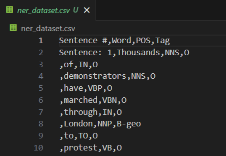

# Named Entiry Recognition

## AIM
To develop an LSTM-based model for recognizing the named entities in the text.

## Problem Statement and Dataset
#### For the given Dataset which consists of various sentences , we have to develop a model to correctly predict the tag for each word in the sentence and classify it its corrosponding clas


## DESIGN STEPS
### STEP 1:
Import the required packages and dataset 
### STEP 2:
Create the model with LSTM
### STEP 3:
Compile the model 
### STEP 4:
Train and test the model with datas.


## PROGRAM
```python
## Kavinraja D
## 212222240047
import matplotlib.pyplot as plt
import pandas as pd
import numpy as np
from tensorflow.keras.preprocessing import sequence
from sklearn.model_selection import train_test_split
from keras import layers
from keras.models import Model

data = pd.read_csv("ner_dataset.csv", encoding="latin1")
data.head(50)
data = data.fillna(method="ffill")
print("Unique words in corpus:", data['Word'].nunique())
print("Unique tags in corpus:", data['Tag'].nunique())
words=list(data['Word'].unique())
words.append("ENDPAD")
tags=list(data['Tag'].unique())
print("Unique tags are:", tags)
num_words = len(words)
num_tags = len(tags)
num_words

class SentenceGetter(object):
    def __init__(self, data):
        self.n_sent = 1
        self.data = data
        self.empty = False
        agg_func = lambda s: [(w, p, t) for w, p, t in zip(s["Word"].values.tolist(),
                                                           s["POS"].values.tolist(),
                                                           s["Tag"].values.tolist())]
        self.grouped = self.data.groupby("Sentence #").apply(agg_func)
        self.sentences = [s for s in self.grouped]
    
    def get_next(self):
        try:
            s = self.grouped["Sentence: {}".format(self.n_sent)]
            self.n_sent += 1
            return s
        except:
            return None
getter = SentenceGetter(data)
sentences = getter.sentences
len(sentences)
sentences[0]
word2idx = {w: i + 1 for i, w in enumerate(words)}
tag2idx = {t: i for i, t in enumerate(tags)}
word2idx
plt.hist([len(s) for s in sentences], bins=50)
plt.show()
X1 = [[word2idx[w[0]] for w in s] for s in sentences]
type(X1[0])
X1[0]
max_length = 50
X[0]
y1 = [[tag2idx[w[2]] for w in s] for s in sentences]
y = sequence.pad_sequences(maxlen=max_len,
                  sequences=y1,
                  padding="post",
                  value=tag2idx["O"])
X_train, X_test, y_train, y_test = train_test_split(X, y,test_size=0.2, random_state=1)

model.summary()
# Write your code here
model.compile(optimizer="adam",
              loss="sparse_categorical_crossentropy",
              metrics=["accuracy"])
history = model.fit(
    x=X_train,
    y=y_train,
    validation_data=(X_test,y_test),
    batch_size=32, 
    epochs=3,
)
metrics = pd.DataFrame(model.history.history)
metrics.head()
metrics[['accuracy','val_accuracy']].plot()
metrics[['loss','val_loss']].plot()
i = 20
p = model.predict(np.array([X_test[i]]))
p = np.argmax(p, axis=-1)
y_true = y_test[i]
print("{:15}{:5}\t {}\n".format("Word", "True", "Pred"))
print("-" *30)
for w, true, pred in zip(X_test[i], y_true, p[0]):
    print("{:15}{}\t{}".format(words[w-1], tags[true], tags[pred]))
    
```

## OUTPUT
### Accuracy vs val_accuracy


### Loss vs Val_loss


### Sample Text Prediction


## RESULT
Thus an LSTM-based model for recognizing the named entities in the text has been developed successfully.
